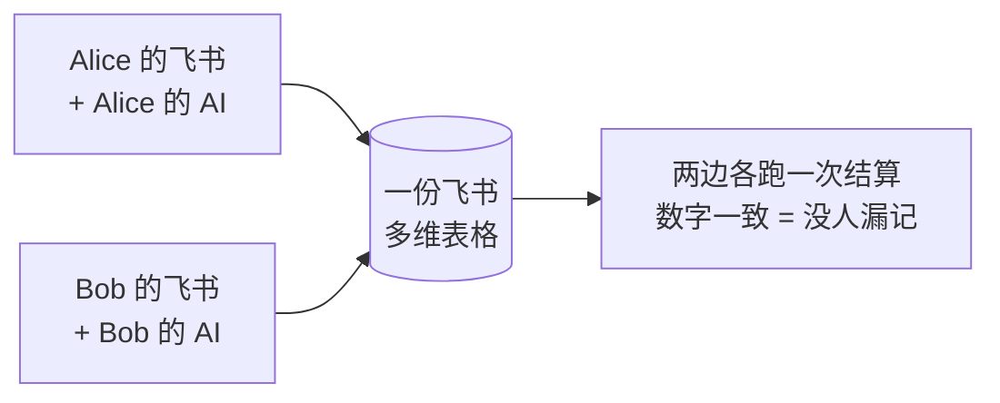

# AUSGLEICH

**两人 AA 记账。丢一堆支付截图给 AI，它还你一个「谁该转给谁多少钱」。**

结算币种固定人民币。原币支持 CNY / HKD。

> 名字是德语的「结算、扯平」。发音大致是 *奥斯-格莱希*。

---

## 它长什么样

吃完火锅、旅行结束、月底，把手机里那堆微信 / 支付宝 / 八达通的付款截图一股脑丢给你的 AI 助手。它逐张识别商户、日期、币种、金额，写进一份飞书多维表格，附上原图。表格用三个公式自己算出净额：

```
本轮共同支出 CNY 453.11，人均 226.56
  Alice  实付 366.71   净额 +140.15
  Bob    实付  86.40   净额 -140.16
→ Bob 转给 Alice ¥140.16
```

## 为什么是两个入口

常见的 AA 记账工具会做一个共享表单，让两个人往同一个入口里填。**这个不做。**

默认场景是**双边协作**：你用你的飞书 + 你的 agent 记你的支出，朋友用他的飞书 + 他的 agent 记他的。两边都往同一个账本写，谁都不用看对方的脸色录数据。

好处很实在：两个人各跑一次结算，数字对得上就说明没人漏记；对不上，立刻知道有人少录了一笔。这比任何"已确认"按钮都可靠。



两个人之间只传一个 `ledger.json`（接头文件）。它不含任何密钥——鉴权靠各人自己的飞书登录态。传丢了也不怕。

## 前提

- 一个飞书账号，且 [`lark-cli`](https://www.npmjs.com/package/@larksuite/cli) 已登录（`lark-cli auth login`）
- 一个**能读图**的 AI 助手（本仓库是它的 skill，它负责识别截图，脚本负责写表）

## 安装

```bash
git clone https://github.com/BaymaxStudio/ausgleich.git ~/.workbuddy/skills/ausgleich
```

或者放到你 agent 的任意 skills 目录下，让它读 `SKILL.md`。

## 用

### 0. 先说你是谁

```bash
mkdir -p ~/.ausgleich && echo '{"name":"Alice"}' > ~/.ausgleich/me.json
```

### 1. 开一轮（建账方做一次）

```bash
# 查个汇率
python3 scripts/rate.py

# 建账 + 给对方开编辑权限
python3 scripts/new_base.py --name "2026-09" --me "Alice" --peer "Bob" \
    --peer-contact "bob@example.com" --rate 0.8568
```

建好会输出一段 `ledger.json`，微信/飞书发给对方就行。

> 如果 `member-add` 失败（比如双方不在同一个飞书组织），脚本会警告但不中断。手动在飞书里把这份 Base 分享给对方、给可编辑权限即可。

### 2. 加入一轮（对方做一次）

```bash
python3 scripts/ledger.py save --json '<粘贴对方发来的 ledger JSON>' --me "Bob"
```

`--me` 必须从 `payers` 里选，填错会直接报错。

### 3. 记账（两边随时做）

把截图丢给你的 AI，它会按 [`references/parse-prompt.md`](references/parse-prompt.md) 的规范逐张识别，先给你看汇总、把拿不准的挑出来问你，确认后写入：

```bash
python3 scripts/post.py --ledger 2026-09 --records records.json
```

```json
[
  {"事项":"海底捞","日期":"2026-09-01","币种":"HKD","金额":428.00,
   "付款人":"Alice","备注":"","image":"/abs/path/shot1.png"}
]
```

- `付款人` 和 `汇率` 可以省略：默认取账本里的 `me` 和 `rate`，CNY 自动填汇率 1
- `image` 可选，有就把原图传到「凭证」列

识别规范的核心一条：**不确定就压低置信度，绝不猜数字。** 一个错误的金额会让整轮账对不上，一个空字段只是让人补一下。

### 4. 结算（两边都能跑）

```bash
python3 scripts/settle.py --ledger 2026-09
```

**两边各自跑一次，数字应当一致。** 对不上就说明有人漏记了——这正是双入口记账最实用的地方。

---

## 表结构

一份 Base 两张表。表名**必须**叫 `支出明细` 和 `结算`，公式里硬编码了这两个名字，改名会让公式失效。

**支出明细**：凭证(附件) / 事项 / 日期 / 币种 / 金额 / 汇率 / 付款人 / 折合CNY(公式) / 备注

**结算**：固定两行一人一行，三个公式——`实付合计`、`应承担`、`净额`。

---

## 安全边界

- 只在你明确要求时新建飞书 Base；**不会**碰你已有的表，也不会改历史轮次的账本。
- 写入前先把识别汇总给你看；`confidence < 0.8` 或有疑点的行一定先问。
- **不会**擅自给任何人开权限；只有你传了 `--peer-contact` 并确认后才会加协作者。
- 不落盘任何 token / 密钥；`ledger.json` 不含密钥，鉴权靠各自的 lark-cli 登录态。
- 不自动执行转账，不做结算锁定，不跨轮累计。

停下来问你的时机：识别置信度低、遇到转账/红包、一图多笔、金额或日期缺失、要开权限、汇率查不到。

`净额 > 0` = 付多了，该收钱；`净额 < 0` = 该转出去。

完整的字段定义和建表命令序列见 [`references/schema.md`](references/schema.md)。

## 已知坑

都踩过了，脚本里已封装：

| 坑 | 表现 | 解法 |
|---|---|---|
| 公式异步计算 | 刚写完读回来是空 | `settle.py` 内置重试（等 3 秒再读，最多 3 次） |
| 附件 `--file` 只收相对路径 | 报 `unsafe file path` | 必须 `cd` 到图片目录（`post.py` 已处理） |
| 公式字段创建 | CLI 直接拒绝 | 必须带 `--i-have-read-guide` |
| 公式依赖顺序 | 建 `净额` 时 `实付合计` 还不存在 | 先建前两个，再建 `净额` |
| select 传值 | 写入失败 | 传数组，单选用 `["CNY"]` |
| datetime 传值 | 写入失败 | 传 `"2026-09-01 12:00"` |

一分钱舍入差：`应承担` 是总额一半四舍五入，两人净额可能差 0.01。正常，按正值方的数转，不要为此改公式。

## 不做什么

这些是刻意的边界，不是没做：

- **只做两个人、只做 AA（50/50）**。不加多人、不加自定义比例、不加"不计入"。
- **一轮 = 一个新 Base**。不做结算锁定、不做跨轮累计、不做历史归档。
- **表格里不放工作流、不放按钮、不放表单**。智能全在 agent 侧。
- **不做共享录入入口**。两个入口，各自独立。
- **仓库里不写死任何人的名字或 base_token**。账本是运行时产生的。你装了就是你的账。

## License

MIT © BaymaxStudio
