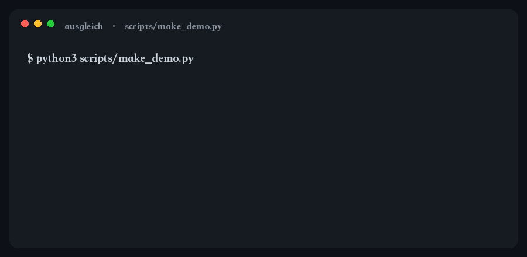
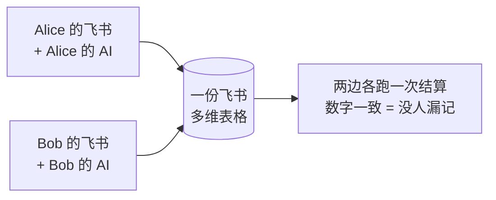

# AUSGLEICH

> **两人 AA 记账。丢一堆支付截图给 AI，它还你一个「谁该转给谁多少钱」。**

[](https://skills.sh/BaymaxStudio/ausgleich)
[](https://skills.sh/BaymaxStudio/ausgleich)
[](LICENSE)

结算币种固定人民币，原币支持 CNY / HKD。名字是德语的「结算、扯平」，发音大致 *奥斯-格莱希*。



<sub>合成数据生成、真实运行输出；`python3 scripts/make_demo.py` 出数据，`python3 scripts/make_gif.py` 重录这张 GIF。</sub>

---

## 你什么时候需要它

- 吃完火锅要平账，手机里一堆微信 / 支付宝付款截图；
- 旅行结束，两个人花的钱还不一定是同一种币（CNY / HKD）；
- 月底和室友对账，谁都不想再手抄一遍流水。

## 它会交付什么

- 一份**飞书多维表格账本**，每一笔都带凭证原图；
- 表格里的三个公式自动算出一个人一行：

```
本轮共同支出 CNY 563.23，人均 281.62
  Alice  实付 409.55   净额 +127.93
  Bob    实付 153.68   净额 -127.94
→ Bob 转给 Alice ¥127.94
```

- 两边各跑一次，数字对得上就说明没人漏记。

## 为什么是两个入口

常见的 AA 工具做一个共享表单，让两个人往同一个入口填。**这个不做。**

默认场景是**双边协作**：你用你的飞书 + 你的 agent 记你的支出，朋友用他的飞书 + 他的 agent 记他的。两边都往同一个账本写，谁都不用看对方脸色录数据。



两个人之间只传一个 `ledger.json`（接头文件）。它不含任何密钥——鉴权靠各人自己的飞书登录态，传丢了也不怕。

## 快速开始

一行安装（Agent Skills 兼容环境）：

```bash
npx skills add BaymaxStudio/ausgleich
```

手动安装（任意 runtime / 任意 skills 目录）：

```bash
git clone https://github.com/BaymaxStudio/ausgleich.git <你的 skills 目录>/ausgleich
```

常见的 skills 目录：`~/.claude/skills`、`~/.codex/skills`、`~/.agents/skills`，或你所用 Agent 自己的目录。

## 前提

- 一个飞书账号，且 [`lark-cli`](https://www.npmjs.com/package/@larksuite/cli) 已登录（`lark-cli auth login`）；
- 一个**能读图**的 AI 助手（本仓库是它的 skill，它负责识别截图，脚本负责写表）。

## 用

### 0. 先说你是谁

```bash
mkdir -p ~/.ausgleich && echo '{"name":"Alice"}' > ~/.ausgleich/me.json
```

### 1. 开一轮（建账方做一次）

```bash
# 查个汇率
python3 scripts/rate.py

# 建账 + 给对方开编辑权限
python3 scripts/new_base.py --name "2026-09" --me "Alice" --peer "Bob" \
    --peer-contact "bob@example.com" --rate 0.8568
```

建好会输出一段 `ledger.json`，微信/飞书发给对方就行。

> 如果 `member-add` 失败（比如双方不在同一个飞书组织），脚本会警告但不中断。手动在飞书里把这份 Base 分享给对方并给编辑权限即可。

### 2. 加入一轮（对方做一次）

```bash
python3 scripts/ledger.py save --json '<粘贴对方发来的 ledger JSON>' --me "Bob"
```

`--me` 必须从 `payers` 里选，填错会直接报错。

### 3. 记账（两边随时做）

把截图丢给你的 AI，它会按 [`references/parse-prompt.md`](references/parse-prompt.md) 的规范逐张识别，先给你看汇总、把拿不准的挑出来问你，确认后写入：

```bash
python3 scripts/post.py --ledger 2026-09 --records records.json
```

```json
[
  {"事项":"海底捞","日期":"2026-09-01","币种":"HKD","金额":428.00,
   "付款人":"Alice","备注":"","image":"/abs/path/shot1.png"}
]
```

- `付款人` 和 `汇率` 可以省略：默认取账本里的 `me` 和 `rate`，CNY 自动填汇率 1
- `image` 可选，有就把原图传到「凭证」列

识别规范的核心一条：**不确定就压低置信度，绝不猜数字。** 一个错误的金额会让整轮账对不上，一个空字段只是让人补一下。

### 4. 结算（两边都能跑）

```bash
python3 scripts/settle.py --ledger 2026-09
```

**两边各自跑一次，数字应当一致。** 对不上就说明有人漏记了——这正是双入口记账最实用的地方。

---

## 安全边界

- 只在你明确要求时新建飞书 Base；**不会**碰你已有的表，也不会改历史轮次的账本。
- 写入前先把识别汇总给你看；`confidence < 0.8` 或有疑点的行一定先问。
- **不会**擅自给任何人开权限；只有你传了 `--peer-contact` 并确认后才会加协作者。
- 不落盘任何 token / 密钥；`ledger.json` 不含密钥，鉴权靠各自的 lark-cli 登录态。
- 不自动执行转账，不做结算锁定，不跨轮累计。

停下来问你的时机：识别置信度低、遇到转账/红包、一图多笔、金额或日期缺失、要开权限、汇率查不到。

---

## 表结构

一份 Base 两张表。表名**必须**叫 `支出明细` 和 `结算`，公式里硬编码了这两个名字，改名会让公式失效。

**支出明细**：凭证(附件) / 事项 / 日期 / 币种 / 金额 / 汇率 / 付款人 / 折合CNY(公式) / 备注

**结算**：固定两行一人一行，三个公式——`实付合计`、`应承担`、`净额`。

---

## 它和同类有什么不同

| | AUSGLEICH | Splitwise | ClawBack | 共享表单 |
|---|---|---|---|---|
| 记账入口 | 两人各自飞书 + 各自 agent | 单人录入 | 群聊自然语言 | 一个共享表单 |
| 对账方式 | 两边各跑一次，数字对不上 = 漏记 | 中心账本 | 中心账本 | 无 |
| 凭证原图 | 存进飞书附件 | 无 | Google Sheets | 无 |
| 币种 | CNY / HKD 固定 | 多币种（付费） | 多币种 | 视实现 |
| 数据归属 | 你自己的飞书 Base | Splitwise 云 | Google Sheets | 视实现 |
| 密钥 | 零密钥，靠各自登录态 | API key | API key | — |

这些工具各有自己的场景，此处只做事实对比。

## 验证与复现

离线跑一遍结算（不连飞书、不需要 lark-cli，用合成数据）：

```bash
python3 scripts/make_demo.py
```

产物：`examples/sample-settlement.json`、`docs/sample-settlement.svg`、`docs/sample-settlement.html`。

重录首屏 GIF（依赖 Pillow）：

```bash
python3 scripts/make_gif.py
```

口径回归测试（四舍五入、缺汇率报错、双入口对称）：

```bash
python3 -m unittest discover -s tests
```

触发与行为样例见 [`test-prompts.json`](test-prompts.json)。

## 文件结构

```
SKILL.md                     给 agent 的操作说明
scripts/ledger.py            账本接头文件的本地管理
scripts/new_base.py          建账 + 开权限
scripts/post.py              写入记录 + 上传凭证
scripts/settle.py            读结算结果
scripts/rate.py              查 HKD->CNY 汇率
scripts/settlement.py        纯函数结算核心（demo / 测试复用）
scripts/make_demo.py         离线合成 demo
scripts/make_gif.py          把 demo 输出录成首屏 GIF（依赖 Pillow）
references/schema.md         表结构与建表命令
references/parse-prompt.md   截图识别规范
examples/                    合成样例产物
tests/                       回归测试
```

## License

MIT
